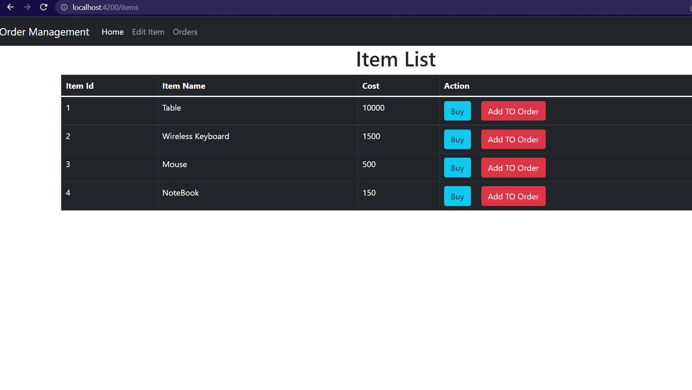
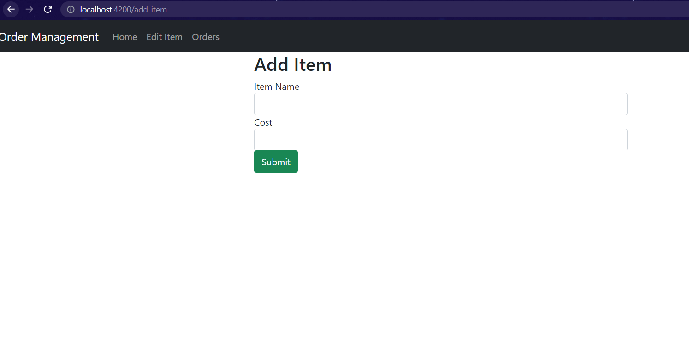
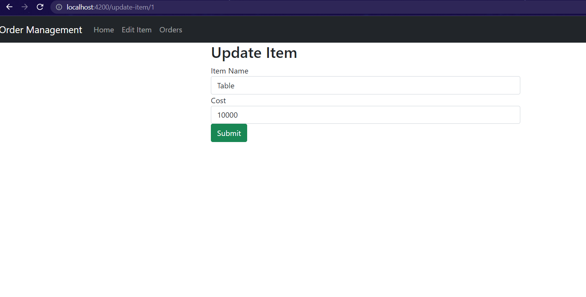
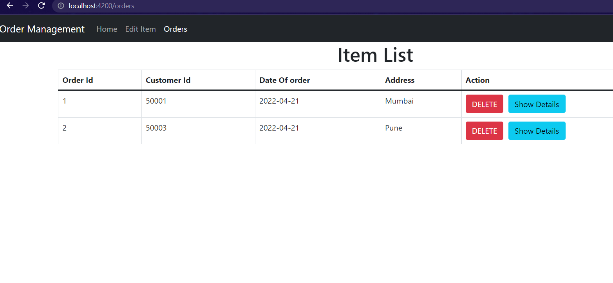
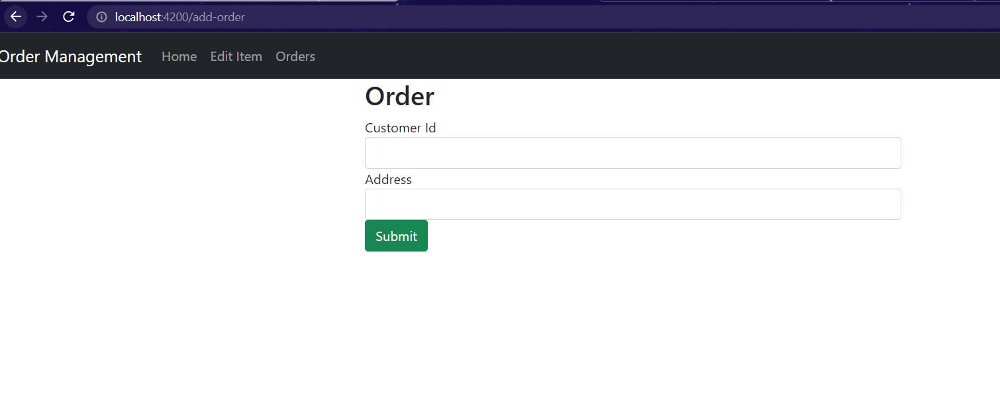
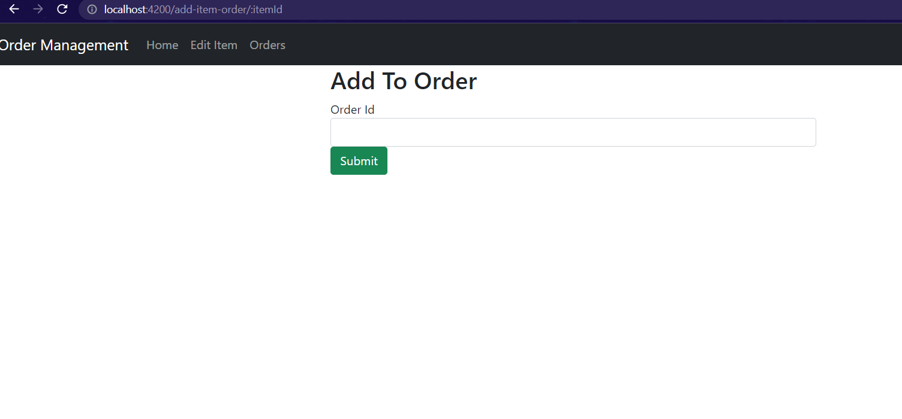

# Order Management System
It is a Basic SpringBoot Application for order management system which uses angular for its front end part. 

## Angular 

#####For going to Angular Page run the application & In browser Type:
```
  http://localhost:4200/
```

## API EndPoints

## --ITEMS--
### Get all items
#### Request

```
  http://localhost:8080/items
```
#### Response
```bash
[
    {
        "itemId": 1,
        "name": "Table",
        "cost": 10000.0,
        "orders": []
    },
    {
        "itemId": 2,
        "name": "Wireless Keyboard",
        "cost": 1500.0,
        "orders": []
    },
    {
        "itemId": 3,
        "name": "Mouse",
        "cost": 500.0,
        "orders": []
    },
    {
        "itemId": 4,
        "name": "NoteBook",
        "cost": 150.0,
        "orders": []
    }
]
```
#### Angular Response


### Get Item with Id.
#### Request
```
  http://localhost:8080/items/1
```

| Parameter | Type     | Description                       |
| :-------- | :------- | :-------------------------------- |
| `itemId`      | `Integer` | Id of item to fetch |

#### Response
```bash
{
    "itemId": 1,
    "name": "Table",
    "cost": 10000.0,
    "orders": []
}
```

### Add item
#### Request
```
  POST: http://localhost:8080/items
```

| Type     | Description                       |
| :------- | :-------------------------------- |
| `Item object in json` | Add items to database. |

#### Response
```bash
  {
    "itemId": 5,
    "name": "IPhone 12",
    "cost": 122641.0
  }
```
#### Angular Response


### Update Item
#### Request
```
  PUT: http://localhost:8080/items/1
```

| Parameter | Type     | Description                       |
| :-------- | :------- | :-------------------------------- |
| `itemId`      | `Integer` | Updates Items in Database with specified Id. |

#### Response
```bash
{
    "itemId": 1,
    "name": "Wireless ",
    "cost": 1500.0,
    "orders": []
}
```
#### Angular Response


### Delete item
#### Request
```http
  DELETE: http://localhost:8080/items/2
```

| Parameter | Type     | Description                       |
| :-------- | :------- | :-------------------------------- |
| `itemId`      | `Integer` | Deletes items from database with specified Id. |

#### Response
```bash
{
    "Deleted": true
}
```

## Orders
### Get all orders
#### Request
```
  GET: http://localhost:8080/orders
```

#### Response
```bash
[
    {
        "orderId": 1,
        "customerId": 50001,
        "dateOfOrder": "2022-04-21",
        "adressOfDelivery": "Mumbai",
        "items": []
    },
    {
        "orderId": 2,
        "customerId": 50003,
        "dateOfOrder": "2022-04-21",
        "adressOfDelivery": "Pune",
        "items": []
    }
]
```
#### Angular Response


### Get order with given Id.
#### Request
```
  GET: http://localhost:8080/orders/2
```

| Parameter | Type     | Description                       |
| :-------- | :------- | :-------------------------------- |
| `orderId` | `Integer` | Id of order to fetch. |

#### Response
```bash
  
    {
        "orderId": 2,
        "customerId": 50003,
        "dateOfOrder": "2022-04-21",
        "adressOfDelivery": "Pune",
        "items": []
    }

```

### Add order
#### Request
```
  POST: http://localhost:8080/orders
```

 | Type     | Description                       |
 | :------- | :-------------------------------- |
 | `Order object in json` | Add items to database. |

#### Response
```bash
{
    "orderId": 3,
    "customerId": 50012,
    "dateOfOrder": "2022-04-21",
    "adressOfDelivery": "Nashik",
    "items": []
}
```
#### Angular Response


### Delete order
#### Request
```
  DELETE: http://localhost:8080/orders/3
```

| Parameter | Type     | Description                       |
| :-------- | :------- | :-------------------------------- |
| `orderId` | `Integer` | Deletes order from database with specified Id.|

#### Response
```bash
{
    "Deleted": true
}
```

### Add Items to Order
#### Request
```http
  PUT: http://localhost:8080/orders/1/3
```

| Parameter | Type     | Description                       |
| :-------- | :------- | :-------------------------------- |
| `orderId` | `Integer` | Id of the order.|
| `itemId` | `Integer` | Id of the item to be added.|

#### Response
```bash
{
    "orderId": 1,
    "customerId": 50012,
    "dateOfOrder": null,
    "adressOfDelivery": "Nashik",
    "items": [
        {
            "itemId": 3,
            "name": "Mouse",
            "cost": 500.0,
        }
 	]
}
```
#### Angular Response


### Delete Items From Order
#### Request
```http
  DELETE: http://localhost:8080/orders/1/3
```

| Parameter | Type     | Description                       |
| :-------- | :------- | :-------------------------------- |
| `orderId` | `Integer` | Id of the order.|
| `itemId` | `Integer` | Id of the item to be removed.|

#### Response
```bash
{
    "orderId": 1,
    "customerId": 50012,
    "dateOfOrder": null,
    "adressOfDelivery": "Nashik",
    "items": []
}
```

### Get cost of order
#### Request
```
  GET: http://localhost:8080/orders/1
```

| Parameter | Type     | Description                       |
| :-------- | :------- | :-------------------------------- |
| `orderId` | `Integer` | Cost of order with specified Id.|

#### Response
```bash
  500.0
```
